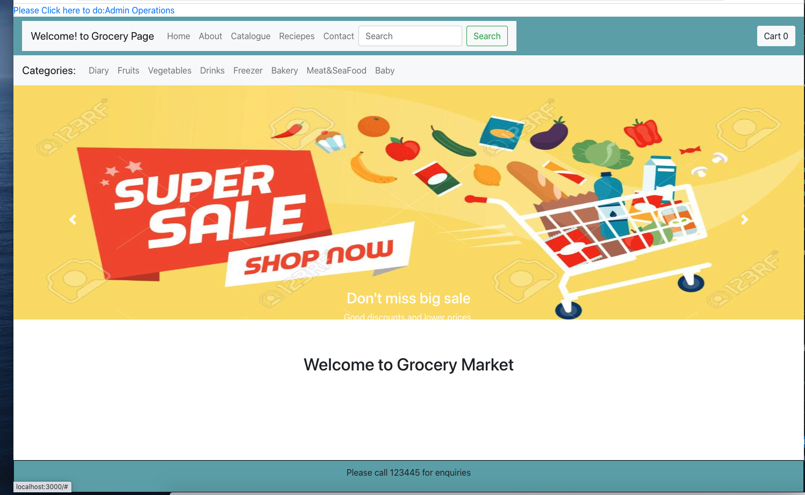
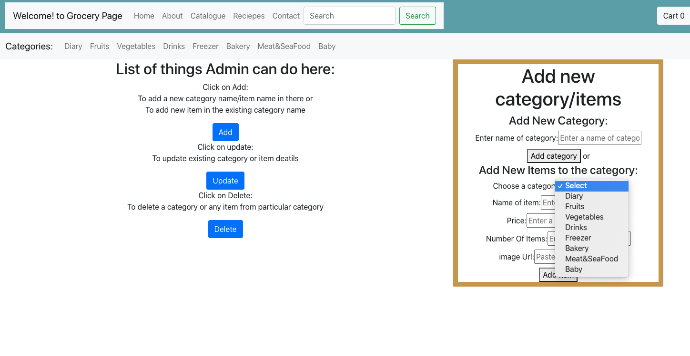
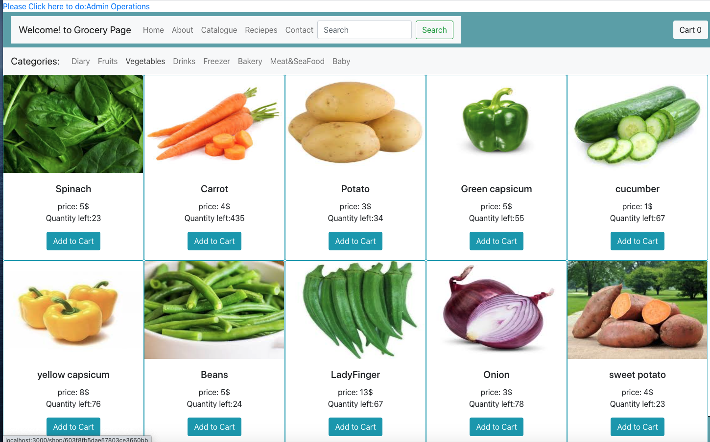

# Project3-GroceryMarket

## Technologies: React.JS and MongoDB.

## Project setup:  

Installation - clone this repo and open in VS code then open terminal

.....>cd client .....>npm install ......>npm start

 ......>cd server .....>npm install ......>npm start

## Project output:

.......> automatically opens your browser on http://localhost:3000/ Where u can see Grocery market page

.......>Goto Admin operations link to add, update and delete grocery items to mongo DB.

. http://localhost:3000/  is a Grocery Market page
......> NavBar on top which naviagates to different pages

.......>Categories NavBar..with list of Category names comming from mongoDB

.......>If u click on any category it displays all items in that category with the details and image

.....> When user clicks on "Add to cart" it will be added to cart

......> there is "Cart" which shows items added to cart